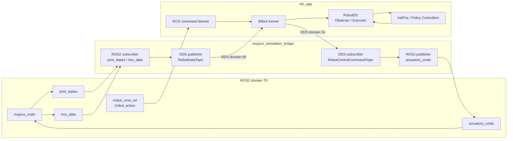

# EFC MuJoCo V2 仿真操作说明与配置介绍

本文档说明 `mujoco_human_v2` 当前已经跑通的仿真链路，包括程序组成、编译方法、启动顺序、ROS2 / DDS 通信关系、主要配置项和常见问题处理。

## 1. 系统组成

当前工程由三个主要进程组成：

| 进程 | 可执行文件 | 职责 |
| --- | --- | --- |
| MuJoCo 仿真节点 | `mujoco_node` | 运行 MuJoCo 场景，发布机器人关节和 IMU 状态，接收关节控制命令。 |
| 仿真桥接程序 | `mujoco_simulation_bridge` | 连接 ROS2 和 Fast DDS：把 MuJoCo 状态转成运控需要的 `RobotDataTopic`，把运控命令转成 MuJoCo actuator 命令。 |
| 运控程序 | `efc_app` | 运行 Bitbot kernel、状态机、策略网络和关节 PD 控制，输出 `RobotControlCommandTopic`。 |

整体链路如下：



## 2. 通信配置

### 2.1 ROS2 Domain

启动脚本默认设置：

```bash
export ROS_DOMAIN_ID=70
```

也可以在启动前手动覆盖：

```bash
ROS_DOMAIN_ID=71 ./start_mujoco_simulation_bridge.sh bridge
```

注意：`mujoco_node`、`mujoco_simulation_bridge`、`efc_app` 如果要通过 ROS2 互相通信，必须处在同一个 `ROS_DOMAIN_ID`。

### 2.2 ROS2 Topic

| Topic | 方向 | 类型 | 说明 |
| --- | --- | --- | --- |
| `joint_states` | `mujoco_node -> mujoco_simulation_bridge` | `sensor_msgs/msg/JointState` | MuJoCo 关节位置和速度。 |
| `imu_data` | `mujoco_node -> mujoco_simulation_bridge` | `sensor_msgs/msg/Imu` | MuJoCo IMU 数据。 |
| `actuators_cmds` | `mujoco_simulation_bridge -> mujoco_node` | `custom_msgs/msg/ActuatorCmds` | 发给 MuJoCo actuator 的控制命令。 |
| `/robot_cmd_vel` | 外部节点 -> `efc_app` | `geometry_msgs/msg/Twist` | 速度指令，映射到 `SetVelAll` 事件。 |
| `/robot_action` | 外部节点 -> `efc_app` | `std_msgs/msg/Int32` | 动作/策略切换指令。 |

桥接程序的 ROS2 话题可以通过参数改名：

```bash
./start_mujoco_simulation_bridge.sh bridge --ros-args \
  -p joint_state_topic:=joint_states \
  -p imu_topic:=imu_data \
  -p actuator_cmd_topic:=actuators_cmds
```

### 2.3 DDS Domain

| DDS Topic | Domain | 方向 | 说明 |
| --- | --- | --- | --- |
| `RobotDataTopic` | 60 | `mujoco_simulation_bridge -> efc_app` | 机器人状态，包含 24 路电机、IMU、电池、报警等数据。 |
| `RobotControlCommandTopic` | 50 | `efc_app -> mujoco_simulation_bridge` | 电机目标位置、力矩、PD、上电和急停命令。 |
| `RobotNotificationTopic` | 22 | `efc_app -> UI/日志` | 运控通知和日志数据。 |
| `TwistTopic` | 23 | 旧 DDS 手柄链路 -> `efc_app` | 旧版 DDS 速度命令入口。 |
| `ActCmdTopic` | 24 | 旧 DDS 手柄链路 -> `efc_app` | 旧版 DDS 动作命令入口。 |

桥接程序默认 DDS domain 是 60 和 50，也可以通过 ROS2 参数覆盖：

```bash
./start_mujoco_simulation_bridge.sh bridge --ros-args \
  -p robot_data_domain_id:=60 \
  -p robot_command_domain_id:=50
```

## 3. 编译

在工程根目录执行：

```bash
cd /home/huahui/zzy/robot_control/mujoco_human_v2
mkdir -p build
/opt/cmake-3.27/bin/cmake -S . -B build
/opt/cmake-3.27/bin/cmake --build build --target mujoco_simulation_bridge efc_app -j4
```

生成的主要可执行文件：

```text
build/mujoco_simulation_bridge
build/efc_app
```

MuJoCo ROS2 节点在 `mj` 目录中，通常已经编译好。若需要重新编译：

```bash
cd /home/huahui/zzy/robot_control/mujoco_human_v2/mj
colcon build
```

## 4. 启动方式

推荐使用工程根目录下的脚本：

```bash
./start_mujoco_simulation_bridge.sh all
```

它会打印当前 domain 和推荐启动顺序。正常需要三个终端分别启动：

```bash
# 终端 1：启动 MuJoCo 仿真
./start_mujoco_simulation_bridge.sh mujoco

# 终端 2：启动 ROS2 / DDS 桥
./start_mujoco_simulation_bridge.sh bridge

# 终端 3：启动运控
./start_mujoco_simulation_bridge.sh control
```

每次启动某个目标前，脚本都会先清理同名旧进程，避免残留进程继续占用 ROS2 topic 或 DDS participant。

如需手动清理三类进程：

```bash
./start_mujoco_simulation_bridge.sh kill
```

脚本会自动处理：

- `ROS_DOMAIN_ID`，默认 70。
- `ROS_LOG_DIR`，默认 `log/ros`。
- MuJoCo、ROS2、custom_msgs、工程 `build` 目录相关 `LD_LIBRARY_PATH`。
- `MUJOCO_ROOT`，默认查找 `/home/huahui/zzy/mujoco-3.2.7`。

## 5. 基本操作流程

启动三个进程后，通常按下面顺序操作：

1. 确认 `mujoco_node` 正常显示仿真场景。
2. 确认 `mujoco_simulation_bridge` 打印收到第一帧 ROS2 `JointState`、`Imu`。
3. 确认 `efc_app` 启动后打印设备列表，并等待机器人状态。
4. 发送初始化或策略事件。

通过 ROS2 发送速度：

```bash
ROS_DOMAIN_ID=70 ros2 topic pub /robot_cmd_vel geometry_msgs/msg/Twist \
  "{linear: {x: 0.2, y: 0.0, z: 0.0}, angular: {x: 0.0, y: 0.0, z: 0.0}}" -r 10
```

通过 ROS2 发送动作事件：

```bash
ROS_DOMAIN_ID=70 ros2 topic pub /robot_action std_msgs/msg/Int32 "{data: 1}" --once
```

`/robot_action` 当前映射：

| data | 事件 | 作用 |
| --- | --- | --- |
| 0 | `STOP` | 停止。 |
| 1 | `InitPose` | 进入初始姿态。 |
| 2 | `RunPolicy` | 运行当前策略。 |
| 3 | `EnableStandingPolicy` | 切到站立策略。 |
| 4 | `EnableWarkingPolicy` | 切到行走策略。 |
| 5 | `EnableRobustPolicy` | 切到 robust 策略。 |
| 6 | `EnableWaveGreeting` | 切到挥手动作。 |
| 7 | `EnableHandshakePolicy` | 切到握手动作。 |
| 8 | `EnableBeyondMimicPolicy` | 切到 bydmimic / BeyondMimic 跳舞策略。 |

也可以继续使用 backend 键盘/事件映射，具体看 `config/backend.json` 和 `user_func.hpp` 中注册的事件。

## 6. 关键配置文件

### 6.1 `config/efc.xml`

该文件是 Bitbot kernel 的硬件/通信配置。

关键项：

```xml
<publisher domain_id="50"
           topic_name="RobotControlCommandTopic" />
<subscriber domain_id="60"
            topic_name="RobotDataTopic" />
```

含义：

- `publisher domain_id="50"`：`efc_app` 向桥接程序发布电机控制命令。
- `subscriber domain_id="60"`：`efc_app` 从桥接程序订阅机器人状态。

仿真中 24 个 `EfcJoint` 当前全部配置为：

```xml
pos_bias="0.0" motor_dir="1"
```

这是仿真直通配置。MuJoCo 模型已经使用关节坐标，不需要实机电机方向修正，也不需要零偏补偿。

`model_id` 必须和桥接程序中的 `kModelIds` 对齐。当前映射在 `src/simulation/mujoco_simulation_bridge_main.cpp`：

```text
motor index -> model_id:
0..5   左腿: 12,13,14,15,16,17
6..11  右腿: 18,19,20,21,22,23
12     腰: 0
13..17 左臂: 7,8,9,10,11
18..22 右臂: 2,3,4,5,6
23     头: 1
```

如果以后改 `efc.xml` 的 `model_id`，桥接程序中的 `kModelIds` 也要同步改。

### 6.2 `config/efc.yaml`

该文件是机器人模型、控制器、策略和日志配置。

顶层关键项：

```yaml
RobotConfig:
  type: "ros2"
  joint_size: 24
  motor_size: 24
  use_parallel_ankle: false
```

`use_parallel_ankle` 是仿真和实机的重要区别：

- `false`：仿真模式。踝关节 pitch/roll 直接使用 MuJoCo 关节，不做并联踝正逆解。
- `true`：实机模式。将串联关节坐标和并联电机坐标互相转换。

仿真必须保持：

```yaml
use_parallel_ankle: false
```

否则踝关节会被二次解算，容易导致姿态异常。

`joint_names` 是控制器看到的关节顺序，`motor_names` 是设备/电机顺序。当前两者都是 24 个自由度，踝关节在仿真里按 pitch/roll 直通使用。

`motor_direction` 当前全部是正方向：

```yaml
motor_direction:
  l_hip_p: 1
  ...
  head_y: 1
```

策略相关配置在 `policy_standing`、`policy_walking`、`policy_robust` 等段落中。重点检查：

| 配置 | 说明 |
| --- | --- |
| `model_path` | ONNX 模型路径，必须存在。 |
| `policy_joint_names` | 策略输出/观测使用的关节列表。 |
| `default_position` | 初始化和策略基准姿态。 |
| `p_gains` / `d_gains` | 关节 PD 参数。 |
| `control_period` | 策略控制周期。 |
| `decimation` | 策略推理降频。 |
| `realtime` | 是否按真实时间控制策略时钟。仿真里通常可设为 `false`。 |

如果启动时报 OpenVINO 无法读取模型，优先检查对应策略的 `model_path`。

### 6.3 `include/efc/robot/robot.h`

这里实现 `RobotEfc` 的 Observer 和 Executor。

当前仿真关键逻辑：

- Observer 默认 `joint_actual_position_ = motor_actual_position_`。
- Executor 默认 `motor_target_position_ = joint_target_position_`。
- 只有 `use_parallel_ankle=true` 时，才做踝关节并联机构正逆解。

因此在仿真中，MuJoCo 关节状态和策略关节目标是一一对应的。

### 6.4 `src/simulation/mujoco_simulation_bridge_main.cpp`

这里定义 MuJoCo joint name 和运控 motor index 的对应关系。

MuJoCo 侧关节名：

```text
left_hip_pitch_joint
left_hip_roll_joint
left_hip_yaw_joint
left_knee_joint
left_ankle_pitch_joint
left_ankle_roll_joint
right_hip_pitch_joint
...
head_joint
```

如果 MuJoCo XML 中关节名变了，必须同步改这里的 `kJointNames`。

## 7. 手动启动命令

不使用脚本时，可以手动执行：

```bash
export ROS_DOMAIN_ID=70
source /opt/ros/humble/setup.bash
source /home/huahui/zzy/robot_control/mujoco_human_v2/mj/install/setup.bash

cd /home/huahui/zzy/robot_control/mujoco_human_v2/mj/src/mujoco_node
/home/huahui/zzy/robot_control/mujoco_human_v2/mj/build/mujoco_node/mujoco_node
```

桥接：

```bash
cd /home/huahui/zzy/robot_control/mujoco_human_v2
./build/mujoco_simulation_bridge
```

运控：

```bash
cd /home/huahui/zzy/robot_control/mujoco_human_v2
./build/efc_app
```

也可以给 `efc_app` 显式传入配置：

```bash
./build/efc_app config/efc.xml config/efc.yaml
```

## 8. 验证命令

查看 ROS2 topic：

```bash
ROS_DOMAIN_ID=70 ros2 topic list
```

查看 MuJoCo 关节状态：

```bash
ROS_DOMAIN_ID=70 ros2 topic echo /joint_states --once
```

查看 IMU：

```bash
ROS_DOMAIN_ID=70 ros2 topic echo /imu_data --once
```

查看 actuator 命令是否发出：

```bash
ROS_DOMAIN_ID=70 ros2 topic echo /actuators_cmds --once
```

查看是否有残留进程：

```bash
pgrep -af "mujoco_node|mujoco_simulation_bridge|efc_app"
```

清理残留：

```bash
./start_mujoco_simulation_bridge.sh kill
```

## 9. 常见问题

### 9.1 编译后找不到可执行文件

确认构建目录是工程根目录下的 `build`：

```bash
cd /home/huahui/zzy/robot_control/mujoco_human_v2
/opt/cmake-3.27/bin/cmake -S . -B build
/opt/cmake-3.27/bin/cmake --build build --target efc_app mujoco_simulation_bridge -j4
ls build/efc_app build/mujoco_simulation_bridge
```

不要在 `build` 目录中执行 `cmake -S .`，因为 `build` 目录没有顶层 `CMakeLists.txt`。

### 9.2 OpenVINO 报无法读取 ONNX

现象类似：

```text
Unable to read the model: .../checkpoint/efc/xxx.onnx
```

处理：

1. 检查 `config/efc.yaml` 中当前策略的 `model_path`。
2. 确认文件存在：

```bash
ls checkpoint/efc
```

3. 修改为实际存在的 ONNX 文件路径。

### 9.3 机器人一启动姿态就翻或关节方向反

优先检查：

- `config/efc.xml` 中所有 `EfcJoint` 是否都是 `motor_dir="1"`。
- `config/efc.xml` 中所有 `EfcJoint` 是否都是 `pos_bias="0.0"`。
- `config/efc.yaml` 中 `use_parallel_ankle` 是否为 `false`。
- `src/simulation/mujoco_simulation_bridge_main.cpp` 中 `kJointNames` 是否和 MuJoCo XML 关节名一致。

仿真里不应该使用实机的电机方向、零偏和踝关节并联解算。

### 9.4 桥接程序收不到 MuJoCo 数据

检查：

```bash
ROS_DOMAIN_ID=70 ros2 topic list
ROS_DOMAIN_ID=70 ros2 topic echo /joint_states --once
ROS_DOMAIN_ID=70 ros2 topic echo /imu_data --once
```

如果看不到 topic，通常是：

- `mujoco_node` 没启动。
- `ROS_DOMAIN_ID` 不一致。
- 没有 source ROS2 或 `mj/install/setup.bash`。

### 9.5 MuJoCo 收不到控制命令

检查 `mujoco_simulation_bridge` 是否打印：

```text
first DDS RobotControlCommand received
```

再检查：

- `efc_app` 是否已经进入控制状态。
- `config/efc.xml` 中 `RobotControlCommandTopic` domain 是否为 50。
- 桥接参数 `robot_command_domain_id` 是否为 50。
- `/actuators_cmds` 是否有数据。

### 9.6 重复启动后行为异常

先清理残留进程：

```bash
./start_mujoco_simulation_bridge.sh kill
```

然后按顺序重新启动：

```bash
./start_mujoco_simulation_bridge.sh mujoco
./start_mujoco_simulation_bridge.sh bridge
./start_mujoco_simulation_bridge.sh control
```

## 10. 文件索引

| 文件 | 说明 |
| --- | --- |
| `start_mujoco_simulation_bridge.sh` | 一键环境配置、启动和进程清理脚本。 |
| `main.cc` | `efc_app` 入口，加载 XML/YAML 配置。 |
| `user_func.hpp` | 运控状态机、控制器注册、ROS2 `/robot_cmd_vel` 和 `/robot_action` 监听。 |
| `include/efc/robot/robot.h` | 机器人 Observer / Executor，包含仿真直通和踝关节解算开关。 |
| `include/simulation/mujoco_simulation_bridge.h` | 桥接程序类定义。 |
| `src/simulation/mujoco_simulation_bridge.cpp` | ROS2 / DDS 桥接实现。 |
| `src/simulation/mujoco_simulation_bridge_main.cpp` | 桥接程序入口，定义 joint name 和 model id 映射。 |
| `config/efc.xml` | Bitbot kernel、DDS 和设备配置。 |
| `config/efc.yaml` | 机器人、控制器、策略模型、PD 和日志配置。 |
| `mj` | MuJoCo ROS2 节点和仿真模型目录。 |

## 11. BeyondMimic 跳舞策略

跳舞策略使用独立的 `BEYOND_MIMIC` controller，不走普通 `AUTO` controller。相关文件：

| 文件 | 说明 |
| --- | --- |
| `include/efc/controller/policy_ctr_beyond_mimic.hpp` | BeyondMimic controller，负责组装 23 关节观测并写入目标关节。 |
| `thirdparty/ovinf/src/ovinf/ovinf_beyond_mimic.cc` | BeyondMimic OpenVINO 推理和参考轨迹推进。 |
| `config/efc.yaml` 的 `policy_beyond_mimic` | 跳舞策略配置。 |
| `checkpoint/efc/policy_bydm_16500.onnx` | 当前默认跳舞模型。 |

启动后发送：

```bash
ROS_DOMAIN_ID=70 ros2 topic pub /robot_action std_msgs/msg/Int32 "{data: 8}" --once
```

即可从当前策略切到 bydmimic 跳舞策略。默认配置 `auto_start: true`，切入策略后会自动开始动作；如果改成 `false`，则需要再给 `/robot_cmd_vel` 一个 `linear.x > 0.15` 的指令触发。
